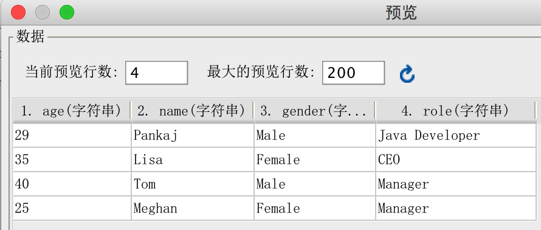

# XML数据集
使用XPath来查找xml中目标节点。
```
<?xml version="1.0" encoding="UTF-8" standalone="no"?>
<Employees>
    <Employee id="1">
        <age>29</age>
        <name>Pankaj</name>
        <gender>Male</gender>
        <role>Java Developer</role>
    </Employee>
    <Employee id="2">
        <age>35</age>
        <name>Lisa</name>
        <gender>Female</gender>
        <role>CEO</role>
    </Employee>
    <Employee id="3">
        <age>40</age>
        <name>Tom</name>
        <gender>Male</gender>
        <role>Manager</role>
    </Employee>
    <Employee id="4">
        <age>25</age>
        <name>Meghan</name>
        <gender>Female</gender>
        <role>Manager</role>
    </Employee>
</Employees>
```
数据集中如果使用XPath语句：
```
/Employees/Employee[age>10]
```
则输出如下所示的结果

